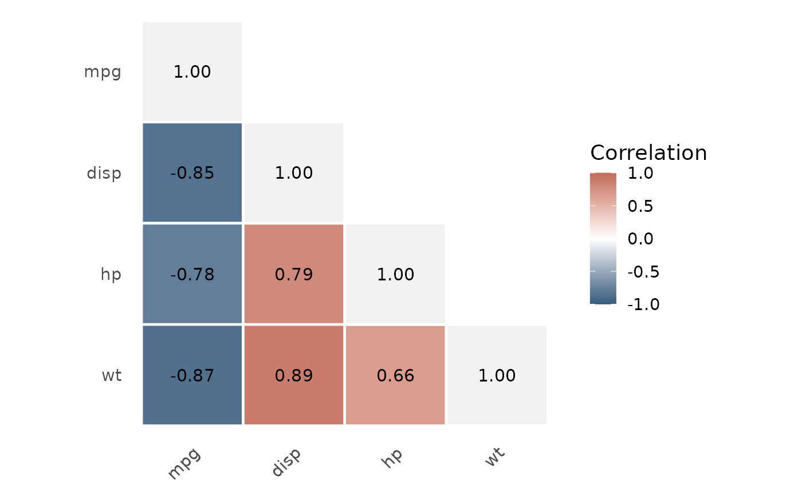

# Inferential Tests and Assumptions

`gtstats` uses conservative, beginner-friendly defaults. Automatic
selection can inspect the data, but it cannot determine whether
observations are independent or whether the design and denominator
answer the intended clinical question. Those decisions remain the
analyst’s responsibility.

## Quantify the magnitude separately

Use
[`effect_size()`](https://gtstats.thinkdenominator.com/reference/effect_size.md)
when the question is how large a difference or association is. Its
default output is deliberately smaller than
[`compare_groups()`](https://gtstats.thinkdenominator.com/reference/compare_groups.md):

``` r

to_flextable(effect_size(mtcars, variable = mpg, group = am))
```

| Measure | Contrast | Estimate | 95% CI |
|----|----|----|----|
| Hedges' g | am: 0 − 1 | -1.35 | -2.18–-0.52 |
| Direction: positive values indicate higher values or greater rank in 0; negative values indicate higher values or greater rank in 1. |  |  |  |
| 95% CI: Approximate large-sample normal interval. |  |  |  |

The automatic measure follows the comparison structure:

- two continuous groups: Hedges’ g, with a confidence interval;
- two-group rank comparison: rank-biserial correlation;
- more than two continuous groups: omega-squared;
- multi-group rank comparison: epsilon-squared;
- categorical association: Cramer’s V.

For a two-group effect, the Contrast column explicitly names the
grouping variable and uses its displayed order: first group minus second
group. Positive and negative standardized or rank effects therefore have
an unambiguous direction. Cramer’s V and omnibus measures describe
association or overall variation and have no direction. Interval method
information is retained in the notes; Hedges’ g intervals are labelled
as approximate large-sample intervals.

An explicit method remains available when the scientific question
requires it:

``` r

to_flextable(effect_size(
  mtcars,
  variable = mpg,
  group = am,
  method = "rank_biserial"
))
```

| Measure | Contrast | Estimate | 95% CI |
|----|----|----|----|
| Rank-biserial correlation | am: 0 − 1 | -0.66 | — |
| Direction: positive values indicate higher values or greater rank in 0; negative values indicate higher values or greater rank in 1. |  |  |  |
| A confidence interval is not currently available for Rank-biserial correlation. |  |  |  |

Generic magnitude labels are excluded by default. Set
`interpretation = TRUE` only when a conventional teaching label is
useful; the table then states that this is not a threshold for clinical
importance. For risk ratios, odds ratios, and risk differences, use
[`crosstabs()`](https://gtstats.thinkdenominator.com/reference/crosstabs.md)
so that the exposure and event direction remain explicit.

## Default selection policy

`compare_groups(test = "auto")` follows these fixed rules. The selected
test is never hidden: it is printed in the result and recorded with its
rule and inputs in `$method`, `$diagnostics`, and `$notes`.

| Comparison | What auto checks | Test selected |
|----|----|----|
| Continuous, two independent groups | Marked skewness within each group; `var_equal` | Welch t-test by default; Student’s t-test when `var_equal = TRUE`; Wilcoxon rank-sum only if one or more groups have marked skewness |
| Continuous, three or more independent groups | Marked skewness within each group; `var_equal` | Welch ANOVA by default; classical ANOVA when `var_equal = TRUE`; Kruskal-Wallis if one or more groups have marked skewness |
| Continuous, paired (two occasions) | Marked skewness of within-pair differences | Paired t-test if not flagged; Wilcoxon signed-rank if flagged |
| Continuous, paired (3+ occasions) | Marked skewness at each occasion | Repeated-measures ANOVA with Greenhouse-Geisser-corrected degrees of freedom if not flagged; Friedman test if flagged |
| Ordinal, independent | Expected cell counts | Pearson chi-square when no expected count is below 1 and no more than 20% are below 5; Fisher’s exact otherwise |
| Ordinal, paired | Outcome is ordered | Wilcoxon signed-rank (two occasions) or Friedman (3+ occasions) |
| Binary or nominal categorical, independent | Expected cell counts | Pearson chi-square when no expected count is below 1 and no more than 20% are below 5; Fisher’s exact otherwise |
| Binary, paired | Paired design and binary outcome | McNemar test (two occasions) or Cochran’s Q test (3+ occasions) |

The continuous-variable switch means **marked** absolute sample skewness
(default cut-off 1), not any asymmetry and not a normality-test p-value.
Shapiro-Wilk is supporting information only and does not alone switch
the test.
[`add_p()`](https://gtstats.thinkdenominator.com/reference/add_p.md)
uses the same rules.

## Ordinal values: make the meaning explicit

[`compare_groups()`](https://gtstats.thinkdenominator.com/reference/compare_groups.md)
retains an `ordered` factor’s ordinal classification, but for an
**independent Table 1 comparison** it uses chi-square/Fisher to compare
the distribution of all levels. Request `test = "wilcox"` or
`test = "kruskal"` if the clinical question is specifically about the
ordered ranks. A numeric variable with a few values (for example `0`,
`1`, `2`, `3` visits or cancer stages coded `1`–`4`) is deliberately
treated as a categorical/count-coded variable unless its order is
explicitly declared. This avoids silently treating a clinical code as a
numerical scale. Convert a true ordered variable before comparing it:

``` r

data$stage <- ordered(data$stage, levels = c(1, 2, 3, 4))
compare_groups(data, variable = stage, group = arm) # categorical distribution
compare_groups(data, variable = stage, group = arm, test = "wilcox") # rank shift
```

[`describe_data()`](https://gtstats.thinkdenominator.com/reference/describe_data.md)
makes this distinction visible: explicit ordered factors are shown as
`ordinal`; small integer-coded variables receive a possible
ordinal/count-coded flag for review against the data dictionary. It does
not change the analysis type automatically.

Other automatic defaults are:

| Question | Default |
|----|----|
| Estimate one proportion | Exact binomial confidence interval |
| Correlate two continuous variables | Pearson for approximately symmetric variables; otherwise Spearman |
| Estimate an event rate | Exact Poisson confidence interval |

## Proportions are estimates, not automatically tests

[`proportion_stats()`](https://gtstats.thinkdenominator.com/reference/proportion_stats.md)
estimates a proportion and Wilson score confidence interval. It does not
test whether groups differ.

``` r

to_flextable(proportion_stats(mtcars, var = vs, by = am))
```

|  | 1 |  | 0 |  |
|----|----|----|----|----|
| Event | n (%) | 95% CI | n (%) | 95% CI |
| 1 | 7 (53.8%) | 29.1–76.8% | 7 (36.8%) | 19.1–59.0% |
| Selected event: vs = 1. Estimates use Wilson score 95% confidence intervals. |  |  |  |  |
| This function estimates a proportion; it does not test differences between groups. |  |  |  |  |
| The denominator must define the population at risk, and observations should be independent. |  |  |  |  |

To compare categorical distributions, use
[`compare_groups()`](https://gtstats.thinkdenominator.com/reference/compare_groups.md),
[`add_p()`](https://gtstats.thinkdenominator.com/reference/add_p.md), or
[`crosstabs()`](https://gtstats.thinkdenominator.com/reference/crosstabs.md).

``` r

to_flextable(compare_groups(mtcars, variable = vs, group = am))
```

[TABLE]

``` r

to_flextable(crosstabs(mtcars, row = am, col = vs))
```

[TABLE]

In automatic mode, expected cell counts are calculated. Fisher’s exact
test is selected when an expected count is below 1 or more than 20% of
expected cells are below 5; otherwise chi-square is used. Larger sparse
tables use Fisher’s test with a Monte Carlo p-value. Returned objects
expose the expected counts and the minimum expected count.

The analyst must still confirm:

- observations are independent;
- each observation contributes to one cell;
- categories are mutually exclusive;
- row and column levels have been defined in the intended direction.

For paired binary observations, supply an identifier and use McNemar’s
test:

``` r

to_flextable(compare_groups(
  paired_data,
  variable = symptom_present,
  group = visit,
  paired = TRUE,
  id = id
))
```

[TABLE]

## Continuous outcomes

Welch’s t-test is the two-group parametric default because it does not
require equal variances. Welch ANOVA is the corresponding default for
three or more groups. When equal variances are justified in a
prespecified analysis plan, `var_equal = TRUE` changes the non-skewed
independent automatic route to Student’s t-test or classical ANOVA. It
does not run, infer, or prove an equal-variance hypothesis test.

Use
[`assess_variance()`](https://gtstats.thinkdenominator.com/reference/assess_variance.md)
to make the observed group spread visible before interpreting a
comparison. It reports SDs, variances, and largest/smallest spread
ratios and displays the median-centred Levene test by default. Bartlett
is available as optional supporting information. These tests are never
gatekeepers and do not change the automatic choice.

``` r

to_flextable(assess_variance(mtcars, vars = mpg, by = am))
```

| Variable | 1 | 0 | Observed SD ratio | Observed variance ratio | Levene p | Interpretation |
|----|----|----|----|----|----|----|
| mpg | n = 13; SD = 6.17; variance = 38.03 | n = 19; SD = 3.83; variance = 14.70 | 1.61 | 2.59 | 0.050 | Levene suggests different spreads; interpret this with the study design. |
| SD and variance ratios are the largest group value divided by the smallest group value. They describe observed spread; they are not pass/fail tests. |  |  |  |  |  |  |
| For independent groups, Welch t-tests and Welch ANOVA do not require equal variances. \`assess_variance()\` does not select an inferential test and does not assess pairing or repeated-measures sphericity. |  |  |  |  |  |  |
| The displayed Levene test is median-centred (Brown-Forsythe). It is supporting information only: its p-value neither proves equal variances nor selects an inferential test. |  |  |  |  |  |  |
| Interpret spread alongside sample size, distributional shape, outliers, missingness, and the study design. |  |  |  |  |  |  |

``` r

to_flextable(assess_variance(mtcars, vars = mpg, by = am, test = "none"))
```

| Variable | 1 | 0 | Observed SD ratio | Observed variance ratio | Interpretation |
|----|----|----|----|----|----|
| mpg | n = 13; SD = 6.17; variance = 38.03 | n = 19; SD = 3.83; variance = 14.70 | 1.61 | 2.59 | Observed SD ratio shown; interpret it with the study design. |
| SD and variance ratios are the largest group value divided by the smallest group value. They describe observed spread; they are not pass/fail tests. |  |  |  |  |  |
| For independent groups, Welch t-tests and Welch ANOVA do not require equal variances. \`assess_variance()\` does not select an inferential test and does not assess pairing or repeated-measures sphericity. |  |  |  |  |  |
| Interpret spread alongside sample size, distributional shape, outliers, missingness, and the study design. |  |  |  |  |  |

``` r

to_flextable(assess_variance(mtcars, vars = mpg, by = am, test = "bartlett"))
```

| Variable | 1 | 0 | Observed SD ratio | Observed variance ratio | Bartlett p | Interpretation |
|----|----|----|----|----|----|----|
| mpg | n = 13; SD = 6.17; variance = 38.03 | n = 19; SD = 3.83; variance = 14.70 | 1.61 | 2.59 | 0.072 | Bartlett's test found no clear evidence of different spreads; this does not prove equal variances. |
| SD and variance ratios are the largest group value divided by the smallest group value. They describe observed spread; they are not pass/fail tests. |  |  |  |  |  |  |
| For independent groups, Welch t-tests and Welch ANOVA do not require equal variances. \`assess_variance()\` does not select an inferential test and does not assess pairing or repeated-measures sphericity. |  |  |  |  |  |  |
| Bartlett's test is supporting information only: it assumes normal group distributions, and its p-value neither proves equal variances nor selects an inferential test. |  |  |  |  |  |  |
| Interpret spread alongside sample size, distributional shape, outliers, missingness, and the study design. |  |  |  |  |  |  |

The same observed-spread diagnostic is retained in an independent
continuous
[`compare_groups()`](https://gtstats.thinkdenominator.com/reference/compare_groups.md)
result. It is descriptive context, not a test-selection rule: Welch
t-tests and Welch ANOVA do not require equal variances. The value of
`var_equal` is a transparent user choice, not a data-driven variance
test.

``` r

to_flextable(compare_groups(
  mtcars,
  variable = mpg,
  group = am,
  test = "auto"
))
```

[TABLE]

``` r


to_flextable(compare_groups(mtcars, variable = mpg, group = cyl))
```

[TABLE]

``` r

to_flextable(compare_groups(mtcars, variable = mpg, group = cyl, test = "anova"))
```

[TABLE]

Distribution guidance primarily uses skewness. Shapiro-Wilk results are
supporting information and are not used alone to select a test. Analysts
should also inspect outliers and plots. To see the exact automatic
decision for one analysis, inspect the saved result:

``` r

result <- compare_groups(mtcars, variable = mpg, group = am)
result$method$selection_rule
#> [1] "Two-group continuous outcome: no skewness flag; `var_equal = FALSE`; selected Welch t-test, the conservative default that does not require equal variances."
result$method$selection_inputs
#> $distribution_guidance
#> [1] "Approximately symmetric; Approximately symmetric"
#> 
#> $skewness_flagged
#> [1] FALSE
#> 
#> $groups
#> [1] 2
#> 
#> $paired
#> [1] FALSE
#> 
#> $var_equal
#> [1] FALSE
#> 
#> $variance_assumption_source
#> [1] "User-specified; not inferred from a variance hypothesis test"
#> 
#> $observed_group_spread
#> $observed_group_spread$group_spread
#> # A tibble: 2 × 4
#>   group     n    sd variance
#>   <chr> <int> <dbl>    <dbl>
#> 1 0        19  3.83     14.7
#> 2 1        13  6.17     38.0
#> 
#> $observed_group_spread$sd_ratio
#> [1] 1.608388
#> 
#> $observed_group_spread$variance_ratio
#> [1] 2.586911
diagnostics_stats(result)
```

| Diagnostics |  |  |  |  |  |
|----|----|----|----|----|----|
| Variable | Check | Result | Observed value | Reference | Interpretation |
| mpg | Comparison design | independent | Independent observations | Defined by the study design | Independent comparison; confirm independence from the study design. |
| mpg | Variance assumption | welch default | var_equal = FALSE | User-specified analytical assumption | Welch is the conservative default and does not require equal variances. No variance hypothesis test was used. |
| mpg | Automatic test selection | Welch t-test | Approximately symmetric; Approximately symmetric | No marked group-level skewness flag for parametric default | Two-group continuous outcome: no skewness flag; \`var_equal = FALSE\`; selected Welch t-test, the conservative default that does not require equal variances. |
| mpg | Distribution guidance | parametric reasonable | Approximately symmetric; Approximately symmetric | Marked absolute skewness guidance; Shapiro-Wilk is supporting information only | Assessment applied within each group. |
| mpg | Observed group spread | descriptive context | 0 (n = 19): SD 3.83; variance 14.70; 1 (n = 13): SD 6.17; variance 38.03; SD ratio = 1.61; variance ratio = 2.59 | Descriptive diagnostic; no pass/fail threshold | Observed spread is descriptive only; no Levene, Bartlett, or F test was performed. \`var_equal = FALSE\` retains Welch methods as the conservative parametric auto default. |

Wilcoxon rank-sum and Kruskal-Wallis tests compare ranks. Interpreting
them specifically as median comparisons requires broadly similar
distribution shapes across groups.

For paired continuous analyses, distribution guidance is applied to the
within-pair differences rather than each measurement occasion
separately.

## Summary-table p-values

[`add_p()`](https://gtstats.thinkdenominator.com/reference/add_p.md)
uses the same automatic selection policy as
[`compare_groups()`](https://gtstats.thinkdenominator.com/reference/compare_groups.md).
Distribution guidance is enabled by default.

``` r

summary_table(mtcars, by = am, include = c(mpg, wt, vs), overall = TRUE) |>
  add_p() |>
  to_flextable()
```

[TABLE]

Tests can be prespecified per variable:

``` r

summary_table(mtcars, by = am, include = c(mpg, wt, vs)) |>
  add_p(
    test = c(
      mpg = "welch_t",
      wt = "wilcox",
      vs = "fisher"
    ),
    distribution_check = FALSE
  ) |>
  to_flextable()
```

[TABLE]

To use the equal-variance parametric route deliberately:

``` r

to_flextable(compare_groups(trial_data, change_score, group = arm, var_equal = TRUE))
```

[TABLE]

The table footnote records tests used and reminds readers that
independence must be confirmed from the study design.

## Correlation

Automatic correlation selection uses marginal distribution shape, but
this cannot confirm the shape of the relationship. Inspect a
scatterplot:

- Pearson requires an approximately linear relationship.
- Spearman requires a monotonic relationship.

With `method = "auto"`,
[`correlation()`](https://gtstats.thinkdenominator.com/reference/correlation.md)
uses Pearson only when both marginal absolute sample skewness values are
below 1; otherwise it uses Spearman. This is a transparent default, not
proof that the relationship is linear or monotonic. Inspect
[`plot_correlation()`](https://gtstats.thinkdenominator.com/reference/plot_correlation.md)
before reporting the coefficient.
[`diagnostics_stats()`](https://gtstats.thinkdenominator.com/reference/diagnostics_stats.md)
records the two skewness values, selected rule, and the number of
complete finite pairs used. - Both require independent observation pairs
without dominating influential observations.

For exploratory work with several continuous variables, supply `vars`
instead of `x` and `y`. One method is deliberately used throughout the
matrix, avoiding a confusing mixture of Pearson and Spearman
coefficients. Each pair may have a different denominator when values are
missing, so inspect `$summary` before reporting selected results.

``` r

matrix_result <- correlation(
  mtcars,
  vars = c(mpg, disp, hp, wt),
  display = "estimate_p",
  adjust = "holm"
)

to_flextable(matrix_result)
```

[TABLE]

``` r

plot_correlation(matrix_result)
```



The heatmap shows direction and magnitude, not importance or causality.
Multiplicity adjustment is available for exploratory p-values, but a
matrix does not replace a prespecified research question.

## Rates

[`rate_stats()`](https://gtstats.thinkdenominator.com/reference/rate_stats.md)
estimates rates with exact Poisson confidence intervals. Confirm that:

- events are valid counts;
- person-time or exposure time is positive and correctly accumulated;
- observations or event processes are suitably independent;
- a Poisson process is a reasonable approximation.

Counts per 100 people at a single time point are proportions, not
incidence rates, unless genuine observation time is represented.

## Inspect what was checked

Inferential objects retain transparent metadata:

``` r

result <- compare_groups(mtcars, variable = vs, group = am)

result$inferential
#> # A tibble: 1 × 27
#>   outcome label outcome_type group group_levels test_requested test_used  paired
#>   <chr>   <chr> <chr>        <chr>        <int> <chr>          <chr>      <lgl> 
#> 1 vs      vs    binary       am               2 auto           Chi-squar… FALSE 
#> # ℹ 19 more variables: statistic <dbl>, df <int>, p_value <dbl>,
#> #   estimate <dbl>, estimate_type <chr>, conf_low <dbl>, conf_high <dbl>,
#> #   conf_level <dbl>, effect_size <dbl>, effect_size_type <chr>,
#> #   effect_size_interpretation <chr>, method_detail <chr>,
#> #   reason_for_test <chr>, interpretation <chr>, notes <chr>,
#> #   effect_size_symbol <chr>, effect_conf_low <dbl>, effect_conf_high <dbl>,
#> #   effect_interval_method <chr>
result$method
#> $outcome_type
#> [1] "binary"
#> 
#> $group_type
#> [1] "binary"
#> 
#> $test_requested
#> [1] "auto"
#> 
#> $test_selected
#> [1] "Chi-square test"
#> 
#> $variance_assumption
#> $variance_assumption$value
#> [1] FALSE
#> 
#> $variance_assumption$source
#> [1] "User-specified; not inferred from a variance hypothesis test"
#> 
#> $variance_assumption$applies
#> [1] FALSE
#> 
#> 
#> $selection_rule
#> [1] "Independent categorical outcome; expected cell count guidance was met (no expected count below 1 and no more than 20% below 5); selected Pearson chi-square test."
#> 
#> $selection_inputs
#> $selection_inputs$groups
#> [1] 2
#> 
#> $selection_inputs$outcome_type
#> [1] "binary"
#> 
#> $selection_inputs$minimum_expected_count
#> [1] 5.6875
#> 
#> $selection_inputs$expected_count_threshold
#> [1] "No expected count < 1 and <=20% below 5"
#> 
#> $selection_inputs$expected_count_screen
#> $selection_inputs$expected_count_screen$sparse
#> [1] FALSE
#> 
#> $selection_inputs$expected_count_screen$any_below_1
#> [1] FALSE
#> 
#> $selection_inputs$expected_count_screen$proportion_below_5
#> [1] 0
#> 
#> $selection_inputs$expected_count_screen$n_below_5
#> [1] 0
#> 
#> $selection_inputs$expected_count_screen$n_cells
#> [1] 4
#> 
#> 
#> 
#> $expected_counts
#>             outcome_clean
#> group_factor       0      1
#>            0 10.6875 8.3125
#>            1  7.3125 5.6875
#> 
#> $expected_count_screen
#> $expected_count_screen$sparse
#> [1] FALSE
#> 
#> $expected_count_screen$any_below_1
#> [1] FALSE
#> 
#> $expected_count_screen$proportion_below_5
#> [1] 0
#> 
#> $expected_count_screen$n_below_5
#> [1] 0
#> 
#> $expected_count_screen$n_cells
#> [1] 4
#> 
#> 
#> $fisher_simulation
#> NULL
result$assumptions
#> # A tibble: 3 × 4
#>   assumption                    status     result       detail                  
#>   <chr>                         <chr>      <chr>        <chr>                   
#> 1 Independent observations      user_check not_checked  Confirm from the study …
#> 2 Mutually exclusive categories user_check not_checked  Confirm that every obse…
#> 3 Adequate expected cell counts checked    guidance_met Automatic selection use…
result$diagnostics
#> # A tibble: 4 × 5
#>   check                    result          value                threshold detail
#>   <chr>                    <chr>           <chr>                <chr>     <chr> 
#> 1 Comparison design        independent     Independent observa… Defined … Indep…
#> 2 Variance assumption      not_applicable  var_equal = FALSE    Applies … `var_…
#> 3 Automatic test selection Chi-square test 5.69                 No expec… Indep…
#> 4 Expected cell counts     guidance_met    5.69                 No expec… Fishe…
result$denominators
#> # A tibble: 2 × 9
#>   variable level group  n_total n_nonmissing n_missing numerator denominator
#>   <chr>    <chr> <chr>    <int>        <int>     <int>     <dbl>       <dbl>
#> 1 vs       NA    am = 1      13           13         0        NA          13
#> 2 vs       NA    am = 0      19           19         0        NA          19
#> # ℹ 1 more variable: rule <chr>
result$notes
#> [1] "The analysis assumes independent observations; study design must confirm this."                                                                                                                                                                            
#> [2] "Automatic selection used distribution guidance or design/cell-count rules. Rule applied: Independent categorical outcome; expected cell count guidance was met (no expected count below 1 and no more than 20% below 5); selected Pearson chi-square test."
#> [3] "Chi-square requires mutually exclusive categories and adequate expected cell counts."                                                                                                                                                                      
#> [4] "Minimum expected cell count was 5.69; Fisher's exact test is selected automatically when an expected count is below 1 or more than 20% are below 5."
```

`$inferential` records the selected test and reason. `$method` contains
detected variable types and method metadata. `$assumptions`
distinguishes automatic checks from requirements that must be confirmed
from the study design. `$diagnostics` records check results, values,
thresholds and interpretation. `$denominators` records total,
non-missing and missing observations together with the numerator,
denominator, group and rule used. `$notes` remains a short
human-readable explanation.

Use the inspection helpers for a consistent tibble or formatted table:

``` r

assumptions_stats(result)
```

| Checks before reporting |  |  |  |
|----|----|----|----|
| Variable | Check before reporting | Action | Details |
| vs | Independent observations | Confirm from study design | Confirm from the study design that each observation contributes independently. |
| vs | Mutually exclusive categories | Confirm from study design | Confirm that every observation contributes to one category per variable. |
| vs | Adequate expected cell counts | Checked automatically | Automatic selection uses Fisher's exact test when any expected count is below 1 or more than 20% are below 5. |

``` r

diagnostics_stats(result)
```

| Diagnostics |  |  |  |  |  |
|----|----|----|----|----|----|
| Variable | Check | Result | Observed value | Reference | Interpretation |
| vs | Comparison design | independent | Independent observations | Defined by the study design | Independent comparison; confirm independence from the study design. |
| vs | Variance assumption | not applicable | var_equal = FALSE | Applies only to independent parametric continuous comparisons | \`var_equal\` does not alter paired, categorical, ordinal, or rank-based routes. |
| vs | Automatic test selection | Chi-square test | 5.69 | No expected count below 1 and no more than 20% below 5 | Independent categorical outcome; expected cell count guidance was met (no expected count below 1 and no more than 20% below 5); selected Pearson chi-square test. |
| vs | Expected cell counts | guidance met | 5.69 | No expected count below 1 and no more than 20% below 5 | Fisher's exact test is selected automatically when expected-count guidance is not met. |

``` r

denominators_stats(result)
```

| Denominator audit |  |  |  |  |  |  |  |  |
|----|----|----|----|----|----|----|----|----|
| Variable | Level | Group | Eligible observations | Used in analysis | Missing / excluded | Numerator | Denominator | Rule |
| vs | NA | am = 1 | 13 | 13 | 0 | NA | 13 | Non-missing outcome observations within group |
| vs | NA | am = 0 | 19 | 19 | 0 | NA | 19 | Non-missing outcome observations within group |

``` r


denominators_stats(result, format = "tibble")
#> # A tibble: 2 × 9
#>   Variable Level Group  `Eligible observations` `Used in analysis`
#>   <chr>    <chr> <chr>                    <int>              <int>
#> 1 vs       NA    am = 1                      13                 13
#> 2 vs       NA    am = 0                      19                 19
#> # ℹ 4 more variables: `Missing / excluded` <int>, Numerator <dbl>,
#> #   Denominator <dbl>, Rule <chr>
```

These audit helpers are intentionally separate from the publication
table:

- [`assumptions_stats()`](https://gtstats.thinkdenominator.com/reference/assumptions_stats.md)
  records what the method assumes, including items that require design
  or clinical judgement rather than a software check.
- [`diagnostics_stats()`](https://gtstats.thinkdenominator.com/reference/diagnostics_stats.md)
  shows numerical checks and automatic decisions in plain language; use
  `view = "audit"` for the underlying technical codes.
- [`denominators_stats()`](https://gtstats.thinkdenominator.com/reference/denominators_stats.md)
  shows the analysed observations, missing values, numerators and
  denominators behind reported percentages, rates and risks;
  `view = "audit"` returns the underlying field names.

Use them to review an analysis before reporting it; they are not
normally included in a manuscript table.
